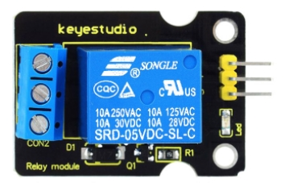
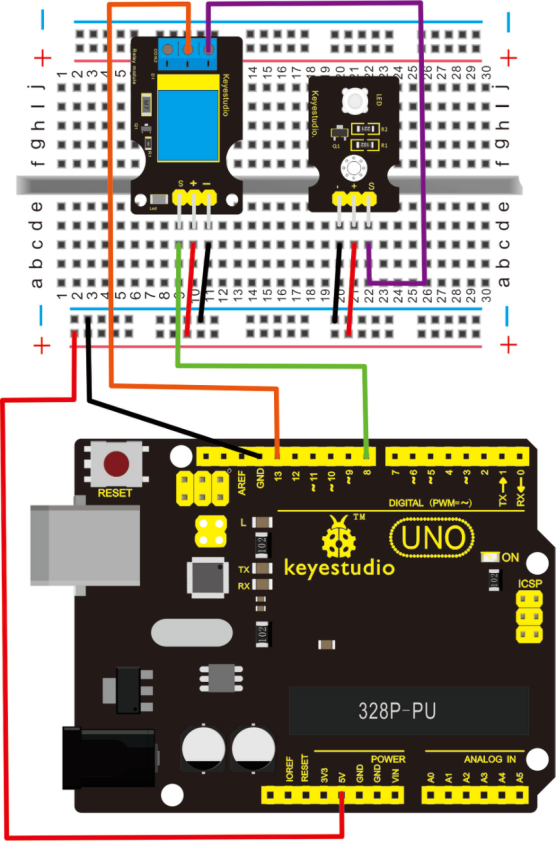
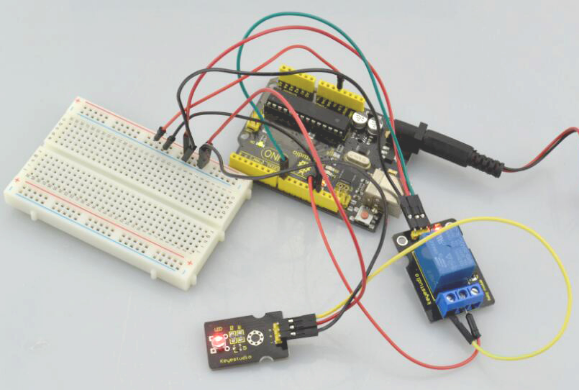

# KS0011 keyestudio 5V Relay Module



## 1. Introduction

This single relay module can be used in interactive projects. It is active HIGH level. This module uses SONGLE 5v high-quality relay.

It can also be used to control lighting, electrical and other equipment.

The modular design makes it easy to expand with the Arduino board (not included). The relay output is by a light-emitting diode. It can be controlled through digital IO port, such as solenoid valves, lamps, motors and other high current or high voltage devices.

## 2. Specification

- Type: Digital
- Rated current: 10A (NO) 5A (NC)
- Maximum switching voltage: 150VAC 24VDC
- Digital interface
- Control signal: TTL level
- Rated load: 8A 150VAC (NO) 10A 24VDC (NO), 5A 250VAC (NO/NC) 5A 24VDC (NO/NC)
- Maximum switching power: AC1200VA DC240W (NO) AC625VA DC120W (NC)
- Contact action time: 10ms

## 3. Connection Diagram

Firstly you need to prepare the following parts by yourself before testing.

- Arduino Board*1
- Single relay module*1
- LED module *1
- USB Cable*1
- Jumper Wire*8



## 4. Sample Code

Download code :  [Code](./Code.7z)

```c
int Relay = 8;

void setup()
{
   pinMode(13, OUTPUT);         //Set Pin13 as output
   digitalWrite(13, HIGH);     //Set Pin13 High
   pinMode(Relay, OUTPUT);     //Set Pin3 as output
}

void loop()
{
   digitalWrite(Relay, HIGH);   //Turn off relay
   delay(2000);
   digitalWrite(Relay, LOW);    //Turn on relay
   delay(2000);
}
```

## 5. Test Result

This relay module is active HIGH level.

Wire it up well, powered up, then upload the above code to the board.

You will see the relay is turned on（ON connected, NC disconnected）for two seconds, then turned off for two seconds（NC closed,ON disconnected）, repeatedly and circularly.

When the relay is turned on, external LED is on. If relay is turned off, external LED is off.

